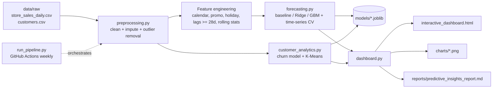

# System Architecture

## Layers
| Layer | Module | Responsibility |
|---|---|---|
| Ingestion | `data_generation.py`, `run_pipeline.py` | Load raw CSVs (or generate demo data) |
| Preparation | `preprocessing.py` | Dedupe, fix negatives, outlier removal (4x rolling median), interpolation, features |
| Modelling | `forecasting.py`, `customer_analytics.py` | Train, tune, evaluate, persist models, score customers, forecast |
| Presentation | `dashboard.py` | KPIs, Plotly dashboard, PNG charts, markdown report |
| Automation | `run_pipeline.py`, `.github/workflows/pipeline.yml` | One-command and scheduled execution |

## Forecasting design
* Target: daily sales per store, log-transformed (multiplicative seasonality).
* Horizon: 28 days. Lags (28, 35, 42, 364) and rolling mean/std are built from `shift(28)` so the same features exist at prediction time.
* Known-in-advance covariates: promo calendar, holidays, climatological temperature, store attributes.
* Validation: `TimeSeriesSplit(3)` grid search on pre-2023 data; final test on 2023; final model refit on all history.

## Customer analytics design
* Churn: stratified 75/25 split, threshold 0.35, selection by ROC-AUC, permutation importance for drivers.
* Segmentation: log + standard scaling of recency, frequency, monetary, basket, promo share; k in 3..6 by silhouette.

## Extending
Replace `data/raw/*.csv` with real data (same columns), or add models in `forecasting.py`; the dashboard and report pick up results automatically.
